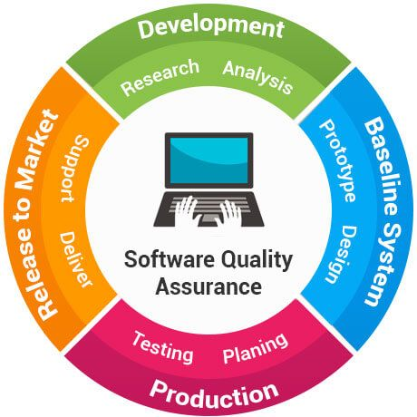

# 한림대학교  소프트웨어융합대학
---
이름 : 최다온   
학번 : 20215255   
소속 : 소프트웨어융합대학   

-------------------   
수강강의   

1.기초수학   
2.이산구조론   
3.자바프로그래밍 I   
4.사고와표현   
5.컴퓨팅사고와문제해결-융합   
6.인공지능영어1-R   

------------------
관심직업 
* 게임 프로그래머
* **소프트웨어 QA**               
* 판테크 전문가   

-------------------

github address: [Daon312][github]   

[github]:http://github.com/Daon312
